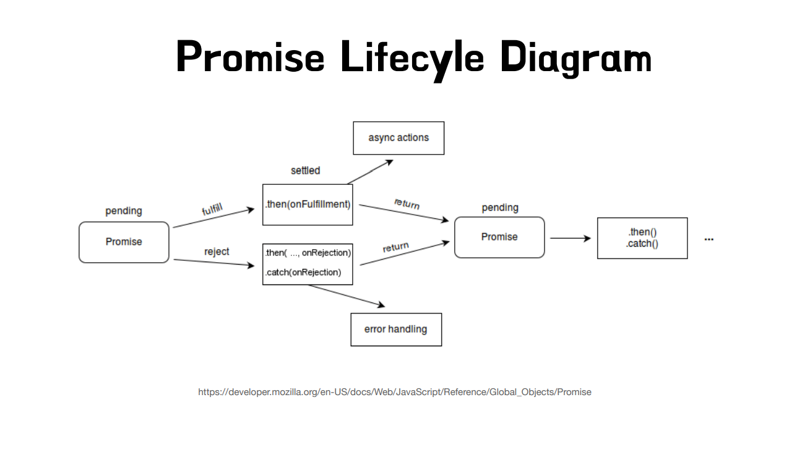

# Promise 패턴 소개

## Promise Lifecycle

<https://www.inflearn.com/courses/lecture?courseId=338204&type=LECTURE&unitId=356894>


### 순서

```javascript
function delay(ms) {
  return new Promise((resolve, reject) => {
    setTimeout(() => {
      resolve(`Waited for ${ms}ms`);
    }, ms);
  });
}

delay(1000)
  .then((res) => {
    console.log(res);
    return res; //return문을 작성 안하면 아래의 then에 Promise가 안넘어감
  })
  .then((res) => {
    console.log("res 받음", res);
  });
```

1. 위의 경우 delay()가 실행되면 Promise가 생성되고
2. setTimeout이 등록된다.
3. 그후 바로 Promise가 반환되는데 이 때문에 return을 할 경우 해당 값에 결과값이 아닌 Promise {<pending>}이 담기게 된다.
4. 그후 delay의 .then이 순서대로 Promise 안의 callbacks 배열에 추가되고
5. 등록된 setTimeout이 실행되며 resolve가 호출된다
6. resolve가 호출되면 Promise의 상태값이 fulfilled로 변경되고 callbacks 배열의 콜백들을 Microtask Queue에 추가한다
7. 현재 실행 중인 코드가 끝나면 Microtask Queue의 콜백들이 순서대로 Call Stack으로 옮겨져 실행된다.
